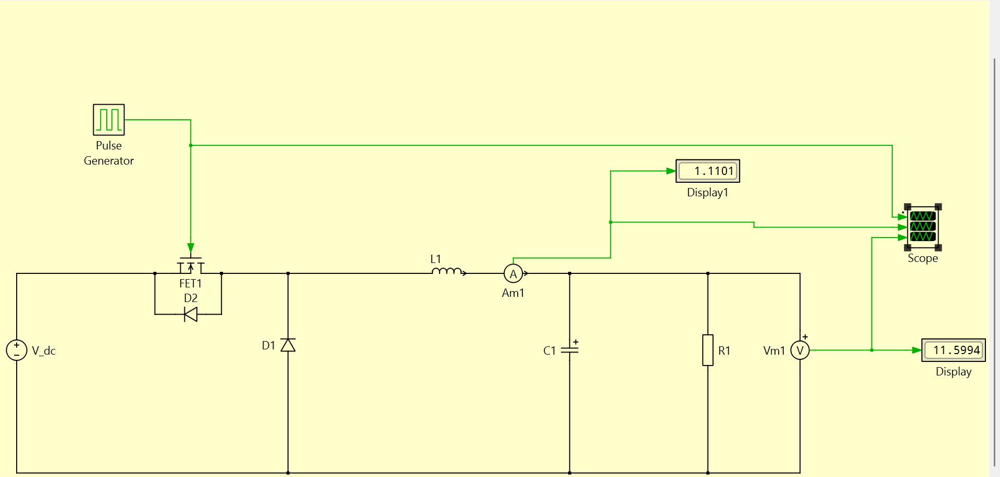
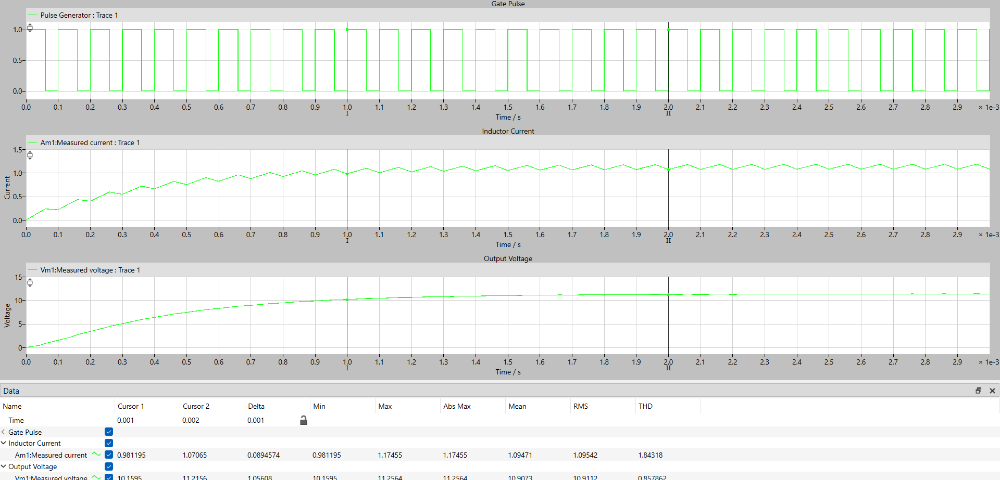
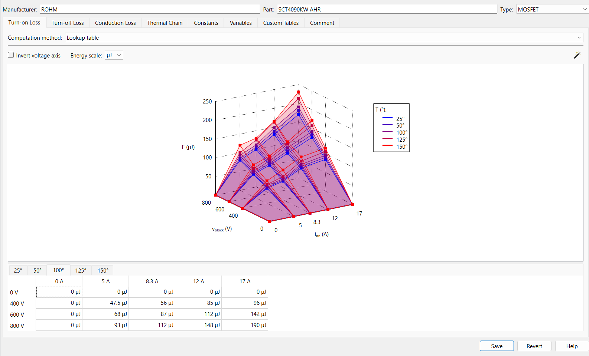
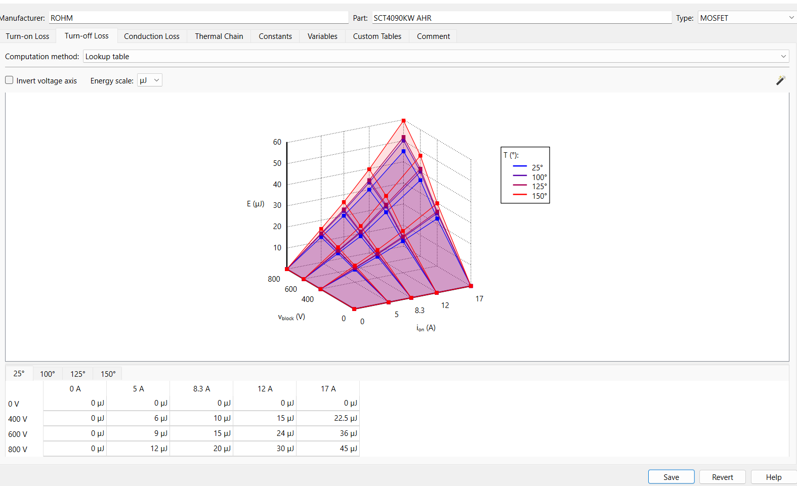
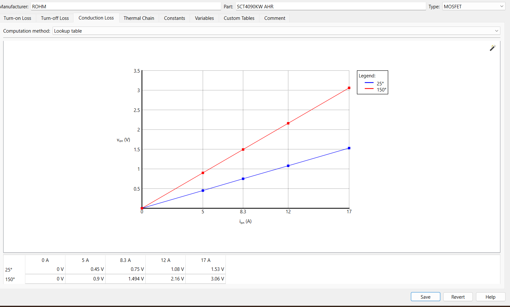
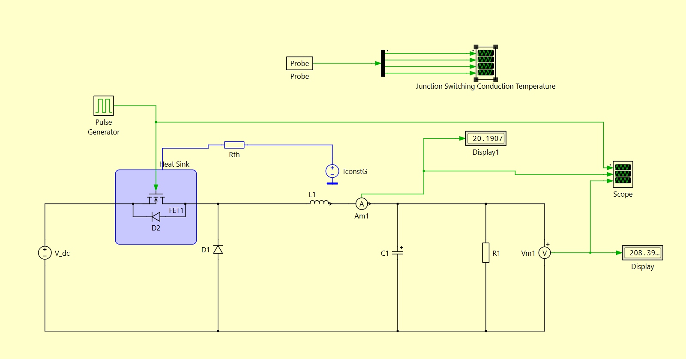
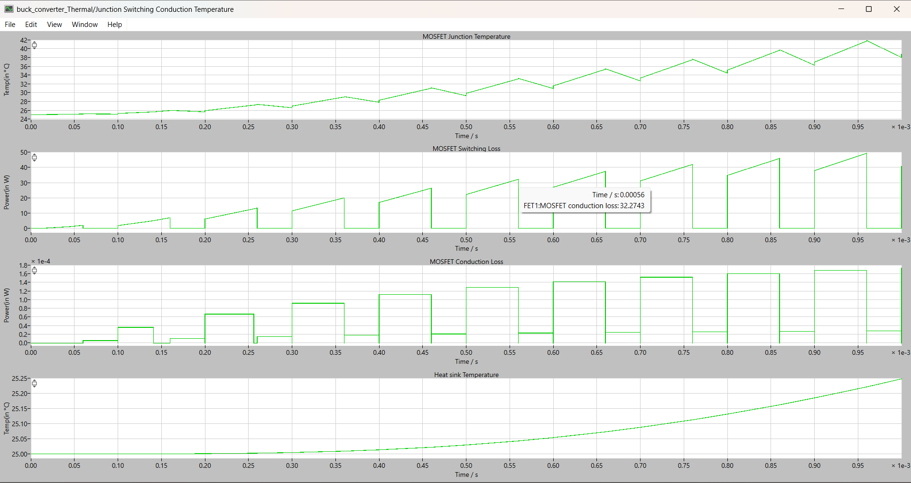

# About

This is a documentaion repo for everything [PLECS](https://plexim.com).

# BUCK CONVERTER

This is a simple tutorial for Design and Simulation of Buck Converter.

- Launch **PLECS STANDALONE** in the system and open it.
- Create a new model _schematic_: Click `Create -> new model` OR (`Ctrl+n`), a blank schematic page (_SchematicPage_) will appear.
- Open the library browser: `SchematicPage -> Window -> Library Browser` (`Ctrl+L`)
- **Select Library Elements** (In SchematicPage):
  - Select DC Voltage Source (`LibraryBrowser->Electrical->Sources-> Voltage Source DC`) : Drag and droop it in the SchematicPage
  - Inductor/Resistor/Capacitor (`LibraryBrowser-> Electrical-> Passive Components-> Inductor/Resistor/Capacitor`)
  - MOSFET/Diode (`LibraryBrowser->Electrical->Power Semiconductors-> MOSFET/Diode`)
  - Ammeter/Voltmeter (`LibraryBrowser->Electrical->Meters->Ammeter/Voltmeter`)
  - Scope/Display(`Library->System-> Scope/Display`)
  - Pulse Generator ( `Library->Control->Sources-> Pulse Generator`)
  - **SAVE**: `File->Save As`

- **Draw Schematic**

We are going to wire the above schemtic.
- **Basic Schematic Commands**:
  - To fit whole schematic in the screen: `View -> Normal(100%)` (`Ctl+*`)
  - Drag elements: `Left-click->Drag`
    - **NOTE** For connected device, `MiddleClick -> Drag` to move without draging the wires.
  - Rotate/Flip: `Select Element -> Ctrl+R/F`
  - Copy/Paste: `Ctrl+C/V`
  - Connecting Wires: `SelectNode` (Plus sign appears) `-> LeftClick -> Drag` to connecting node.
  - Changing Parameters for eg. Scope: `DoubleClick` on elemet, `File-> ScopeParameters -> no Of Plots`
  - **NOTE** Keep saving
  - Changing _Instance Name_ : `DoubleClick` on the name of the instance (eg. `V_dc`) and change the name.
- **Update schematic Parameters**:
  - `V_dc`: 20 V
  - Diode : $V_f = 0.8V$ , $R_{ON} = 0.001 \Omega$
  - MOSFET: $R_{ON}=0.1 \Omega$  
  - Inductor: $L = 5m H$
  - Capacitor: $C = 6.25 \mu F$
  - Resistors: $R1 = 10 \Omega$
  - Pulse Source: $Freq = 10kHz$
- **Simulation**
   - To start the simulation (`Simulation->Start`) OR (`Ctrl+t`).
   - To set the time span of simulation:`Simulation->Simulation parameters->Time span` OR (`Ctrl+l`)
   - Observe the Output volatage on the display block.
   - The output voltage should be higher than the input voltage,here it should be `V_m1`: 11.5994 V.
   - **NOTE** If there wii be any simulation error or any error in circuit connection then `Diagnostics` window will appear,highlighting the error part in the cirucit.
- **SCOPE ANALYSIS**
   - Select the scope element to view the plots.
   - Click on (`View menu->Show legend`) to know the exact plot of corresponding block element.
   - For labelling the subplots:(`File->Scope Parameters->Plot->Title/Axis label/Time axis`).
   - To know a particular value on the subplot place the `Cursor` on the waveform,the value will appear.
   - To have the subplots in a synchronized order (`View->Zoom to fit`)
   - To know the properties of the plots and waveform:
      - Select the `Cursors` icon.
      - Two vertical lines will appear on the plot(Cursor1 and Cursor2).
      - We can select the range by dragging the cursors as per requirement.
      - Click on the drop down arrow beside it.
      - Now select the properties like (Max,min,THD(Total Harmonic Distortion),Delta,RMS,Slope,etc).
      - This will give all the local properties within the choosen range.
      - All the data will appear in the data window at the bottom of the scope window.
      - The plot can  be saved as pdf file by (`File->Export->As pdf`).
   - **PLOT**
     

      - In the above shown plot,the range was taken from 1 to 2 in the time axis: `(Cursor1 at 1)` and `(Cursor2 at 2)`.
      - After setting the range we get all the properties of the plot such as:
        - For Inductor Current: Delta=`0.0894574`, Min value=`0.981195`,Max value=`1.17455`,Abs Max Value=`1.17455`,Mean=`1.09471`,RMS value=`1.09542`,THD=`1.84318`.
        - For Output Voltage: Delta=`1.05608` Min value=`10.1595`,Max value=`11.2564`,Abs Max Value=`11.2564`,Mean=`10.9073`,RMS value=`10.9112`,THD=`0.857862`.
       
  # Thermal Modelling Of the Switch
  
     Following steps describe the procedure of thermal modelling of Power Semiconductor device.

     - After completing the design of the circuit,to add the thermal description : Click on the Switch(here MOSFET). A page with `Parameters`,`Thermal`,`Assertion` will appear.
     - To add the thermal Description: Click `Thermal->New Thermal description`. The device parameter wimdow appears.
     - To add the data: Select a datasheet for a MOSFET, add the data manually,and also select the type of the switch (here MOSFET).
     - The parameters such as Voltage,Current,Energy and Temperature is taken from datasheet.
     - From the MOSFET datasheet observe the values and graphs for:
        - Voltage(V_dd)
        - Current(I_d)
        - Energy(E_on and E_off)
        - Temperature
     - Take atleast 2 to 3 Temperature reading and the corresponding switching data for turn-on and turn-off switching losses.
     - To give multiple value in the table for Temperature/Voltage/Current `(Right click on 25'C/0V/0A->New temperature values/Voltage values/Current Values)`.
     - Enter the Energy values by selecting the block corresponding to the voltage and current values.
     - The graph will automatically display the 3D structure according to the given values.
     - Below shown image is the graph of Turn-on loss:
      

     - Similarly for turn-off loss follow the same guidelines mentioned above.
     - Below shown image is the graph of Turn-off loss:
      

     - For `CONDUCTION LOSS` : To give multiple value in the table for Temperature/Current `(Right click on 25'C/0A->New temperature values/Current Values)`.
     - Enter the voltage values by selecting the block corresponding to the tempearture and current values.
     - The value of `V_on` can be determined using the formula: `V_on = I_on * R_ds`.
     - The value of R_ds for a particular temperature can be obtained from the datasheet and `I_on = I_d` (obtained from the datasheet).
     - Below shown image is the graph of Conduction loss:
       

     - For `Thermal Chain` :
     - Enter the type as per the datasheet taken.
     - Set number of elements as per requirement (here 3)
     - Now enter the corresponding values (as per the datasheet) .

     - To save the description file Click `(Save->file name)` with an `.xml` extension in the desktop,creating a separte folder.
     - To add the description in PLECS click `(File->Plecs Preferences->Thermal->Add the folder by clicking + icon->Close)`.
     - Click on the switch `(Thermal->Button beside the Thermal Description->From library->File name->OK)`.
     - Set the initial temperature at 25 degree C and thermal interference resistance as 0.2 .
     - **Select Thermal Library Elements** :
         - Click `(LibraryBrowser->Thermal->Components-> Heat sink)`.
         - Placed the Heat sink on the switch(with the diode).
         - thermal resistor(Rth): `(LibraryBrowser->Thermal->Components-> Thermal Resistor)` .
         - Constant Temperature (Grounded) :`(LibraryBrowser->Thermal->Sources-> Constant Temperature (Grounded))` .
         - Heat flow meter: `(LibraryBrowser->Thermal->Meter->Heat flow meter)` .
         - Probe : `(LibraryBrowser->System->Probe)` .
         - Signal Demultiplexer: `(LibraryBrowser->System->Signal Demultiplexer)` .
         - Connect the circuit as per the diagram shown:
            
- **Probe Connection** :
    - Click on the `Probe` , a Probe editor page will appear drag the MOSFET and the heat sink of the designed circuit inside the Editor page.
    - Now keep The MOSFET first and heat sink second on the list (The order can be changed by clicking the upward and downward arrow.
    - Select the necessary `Component Signals` for MOSFET(like MOSFET junction temperature,switching losses,conduction losses,etc) and Heat sink (Temperature).
    - Connect the `Probe` to the Signal Demultiplexer.
    - To change the number of outputs of Demultiplexer Click `Signal Demultiplexer->Number of output Ports`. 
    - Set the number of output ports equal to the number of `Component Signals`.
    - Now Connect the Probe to the scope through the Signal Demultiplexer.
    - Graph for the Component Signals:
       

     
    

     
    
    

