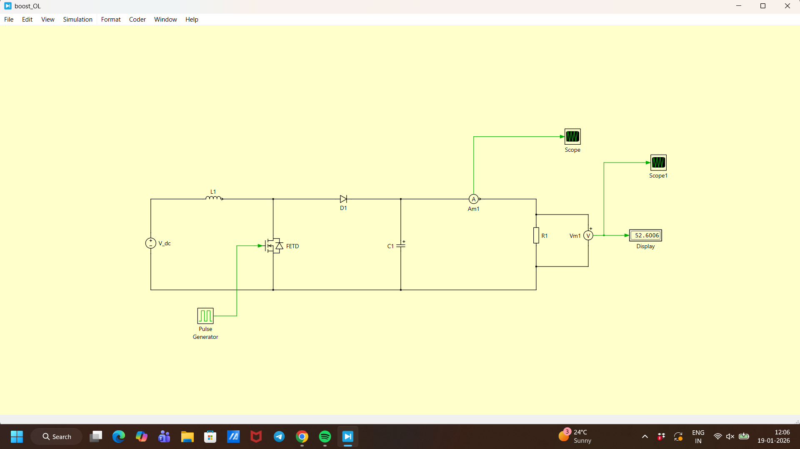
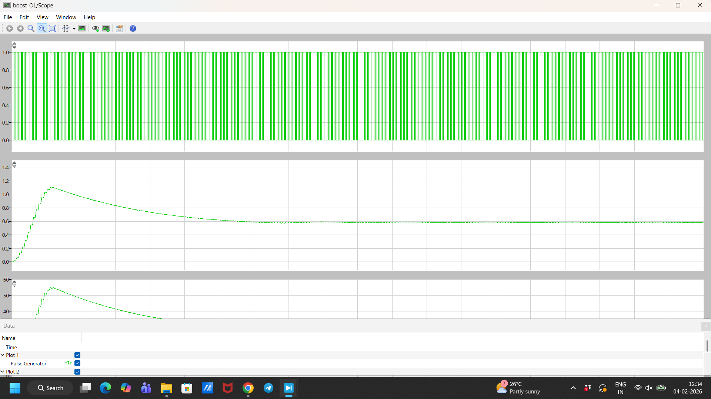

# About

This is a documentaion repo for everything [PLECS](https://plexim.com).

# BUCK CONVERTER

This is a simple tutorial for Design and Simulation of Buck Converter.

- Launch **PLECS STANDALONE** in the system and open it.
- Create a new model _schematic_: Click `Create -> new model` OR (`Ctrl+n`), a blank schematic page (_SchematicPage_) will appear.
- Open the library browser: `SchematicPage -> Window -> Library Browser` (`Ctrl+L`)
- **Select Library Elements** (In SchematicPage):
  - Select DC Voltage Source (`LibraryBrowser->Electrical->Sources-> Voltage Source DC`) : Drag and droop it in the SchematicPage
  - Inductor/Resistor/Capacitor (`LibraryBrowser-> Electrical-> Passive Components-> Inductor/Resistor/Capacitor`)
  - MOSFET/Diode (`LibraryBrowser->Electrical->Power Semiconductors-> MOSFET/Diode`)
  - Ammeter/Voltmeter (`LibraryBrowser->Electrical->Meters->Ammeter/Voltmeter`)
  - Scope/Display(`Library->System-> Scope/Display`)
  - Pulse Generator ( `Library->Control->Sources-> Pulse Generator`)
  - **SAVE**: `File->Save As`

- **Draw Schematic**

We are going to wire the above schemtic.
- **Basic Schematic Commands**:
  - To fit whole schematic in the screen: `View -> Normal(100%)` (`Ctl+*`)
  - Drag elements: `Left-click->Drag`
    - **NOTE** For connected device, `MiddleClick -> Drag` to move without draging the wires.
  - Rotate/Flip: `Select Element -> Ctrl+R/F`
  - Copy/Paste: `Ctrl+C/V`
  - Connecting Wires: `SelectNode` (Plus sign appears) `-> LeftClick -> Drag` to connecting node.
  - Changing Parameters for eg. Scope: `DoubleClick` on elemet, `File-> ScopeParameters -> no Of Plots`
  - **NOTE** Keep saving
  - Changing _Instance Name_ : `DoubleClick` on the name of the instance (eg. `V_dc`) and change the name.
- **Update schematic Parameters**:
  - `V_dc`: 20 V
  - Diode : $V_f = 0.8V$ , $R_{ON} = 0.8 \Omega$
  - MOSFET: $R_{ON}=0.1 \Omega$  
  - Inductor: $L = 1m H$
  - Capacitor: $C = 6.25 \mu F$
  - Resistors: $R1 = 10 \Omega$
  - Pulse Source: $Freq = 50e3 Hz$
- **Simulation**
   - To start the simulation (`Simulation->Start`) OR (`Ctrl+t`).
   - To set the time span of simulation:`Simulation->Simulation parameters->Time span` OR (`Ctrl+l`)
   - Observe the Output volatage on the display block.
   - The output voltage should be higher than the input voltage,here it should be `V_m1`: 5.126 V.
   - **NOTE** If there wii be any simulation error or any error in circuit connection then `Diagnostics` window will appear,highlighting the error part in the cirucit.
    

#  BOOST CONVERTER

  Tutorial for design and simulation of Boost converter.

- Create a new model _schematic_: Click `Create -> new model` OR (`Ctrl+n`), a blank schematic page (_SchematicPage_) will appear.
- Open the library browser: `SchematicPage -> Window -> Library Browser` (`Ctrl+L`)
- **Select Library Elements** (In SchematicPage):
  - Select DC Voltage Source (`LibraryBrowser->Electrical->Sources-> Voltage Source DC`) : Drag and droop it in the SchematicPage
  - Inductor/Resistor/Capacitor (`LibraryBrowser-> Electrical-> Passive Components-> Inductor/Resistor/Capacitor`)
  - MOSFET/Diode (`LibraryBrowser->Electrical->Power Semiconductors-> MOSFET/Diode`)
  - Ammeter/Voltmeter (`LibraryBrowser->Electrical->Meters->Ammeter/Voltmeter`)
  - Scope/Display(`Library->System-> Scope/Display`)
  - Pulse Generator ( `Library->Control->Sources-> Pulse Generator`)
  - **SAVE**: `File->Save As`

- **Draw Schematic**
- 

Wiring the above schematic:

- **Basic Schematic Commands**:
  - To fit whole schematic in the screen: `View -> Normal(100%)` (`Ctl+*`)
  - Drag elements: `Left-click->Drag`
    - **NOTE** For connected device, `MiddleClick -> Drag` to move without draging the wires.
  - Rotate/Flip: `Select Element -> Ctrl+R/F`
  - Copy/Paste: `Ctrl+C/V`
  - Connecting Wires: `SelectNode` (Plus sign appears) `-> LeftClick -> Drag` to connecting node.
  - Changing Parameters for eg. Scope: `DoubleClick` on elemet, `File-> ScopeParameters -> no Of Plots`
  - **NOTE** Keep saving
  - Changing _Instance Name_ : `DoubleClick` on the name of the instance (eg. `V_dc`) and change the name.

 - **Update schematic Parameters**:
  - `V_dc`: 12 V
  - Diode : $V_f = 0.8V$ , $R_{ON} = 0.001 \Omega$
  - MOSFET: $R_{ON}=0.1 \Omega$  
  - Inductor: $L = 120 \mu H$
  - Capacitor: $C = 48 \mu F$
  - Resistors: $R1 = 50 \Omega$
  - Pulse Source: $Freq = 25e3 Hz$
  - Duty cycle=0.6
- **Simulation**
   - To start the simulation (`Simulation->Start`) OR (`Ctrl+t`).
   - To set the time span of simulation:`Simulation->Simulation parameters->Time span` OR (`Ctrl+l`)
   - Observe the Output volatage on the display block.
   - The output voltage should be higher than the input voltage,here it should be `V_m1`: 29.277 V.
  - **NOTE** If there wii be any simulation error or any error in circuit connection then `Diagnostics` window will appear,highlighting the error part in the cirucit.
-**Graph Analysis**
   - Connect the `Pulse Generator` to the 1st subplot of the scope.
   - Connect the `Ammeter Am1` to the 2nd subplot of the scope.
   - Connect the `Voltmeter Vm1` to the 3rd subplot of the scope.
   - Using the scope parameters we can Label the Graph,name the axis.
   - **Output waveform**
     -

     
    
    

